# abstractive-text-summarization

Here [NEWS SUMMARY](https://www.kaggle.com/sunnysai12345/news-summary) dataset is used to create an `abstractive text summarizer` model. Also to speed up the learning process [GloVe 6B](https://www.kaggle.com/anindya2906/glove6b) for the pretrained word embedding.

The [notebook](./notebook.ipynb) also contains the `preprocessing` stage for `NLP` tasks using **Tensorflow2** the later processing in `preprocessing` stage covers efficient way for processing text data for `encoder` and `decoder` architecture.

## Getting started

The [notebook](https://www.kaggle.com/akashsdas/abstractive-text-summarization) is available on Kaggle to work in the same environment where this notebook was created i.e. use the same version packages used, etc...

## Notebook info

The dataset has 100,258 examples and the model created here is trained using `TPU`.

**There 3 different training models used here**

- `build_seq2seq_model_with_just_lstm` - **Seq2Seq model with just LSTMs**. Both `encoder` and `decoder` have just `LSTM`s.
- `build_seq2seq_model_with_bidirectional_lstm` - **Seq2Seq model with Bidirectional LSTMs**. Both `encoder` and `decoder` have `Bidirectional LSTM`s.
- `build_hybrid_seq2seq_model` - **Seq2Seq model with hybrid architecture**. Here `encoder` has `Bidirectional LSTM`s while `decoder` has just `LSTM`s.

Also the `inference` methods and `decode_sequence` methods for all the 3 models are there.

The `model (the trained model)`, `encoder_model (for inference)` and `decoder_model (for inference)` for **Seq2Seq with just LSTMs** are only saved and can be found in this project's Kaggle's [kernel](https://www.kaggle.com/akashsdas/abstractive-text-summarization/output).

Although models for **Seq2Seq with just LSTMs** are saved, the [notebook](./notebook.ipynb) has all the 3 models trained, inferred and are used make predictions.

The tokenizers for `headlines` and `text` (columns of the dataset) are also saved and can be found in this project's Kaggle's [kernel](https://www.kaggle.com/akashsdas/abstractive-text-summarization/output).

The `processed dataset` for this projects is also saved in this project's Kaggle's [kernel](https://www.kaggle.com/akashsdas/abstractive-text-summarization/output)

## Exploratory Data Analysis Results

**New headlines wordcloud**

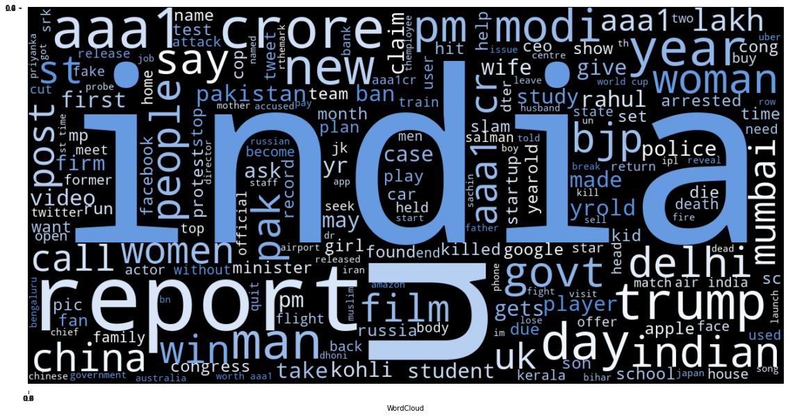

**New news text wordcloud**

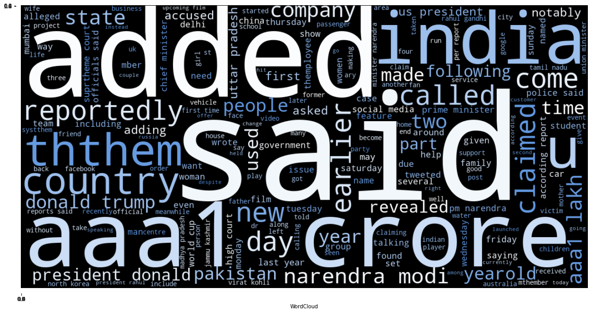

**Word distribution for headlines and text**

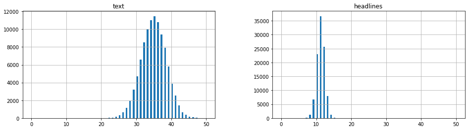

## All the models performance

### Seq2Seq model with just LSTMs

**Model's accuracy curve**

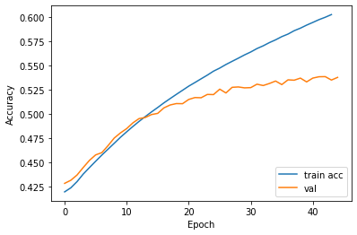

**Model's loss curve**

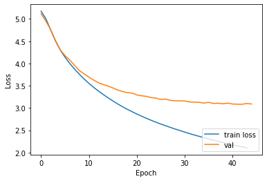

**Predictions**

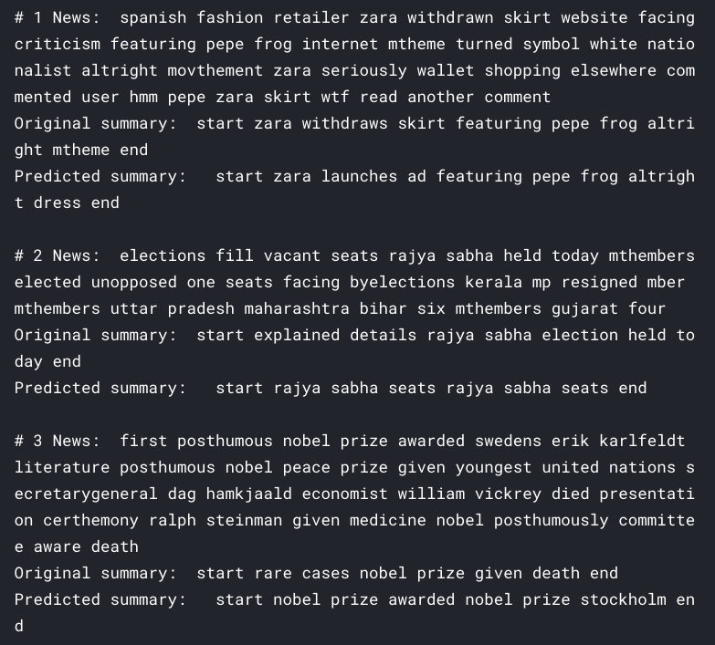

### Seq2Seq model with Bidirectional LSTMs

**Model's accuracy curve**

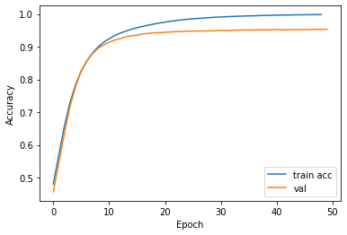

**Model's loss curve**

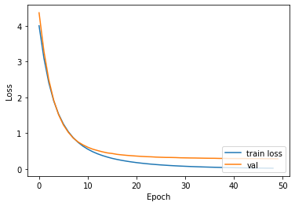

**Predictions**

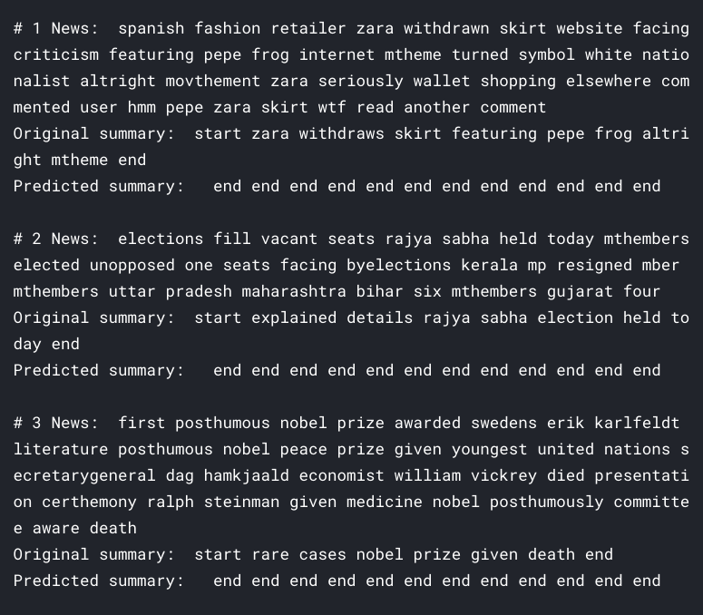

### Seq2Seq model with hybrid architecture

**Model's accuracy curve**

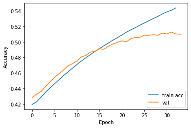

**Model's loss curve**

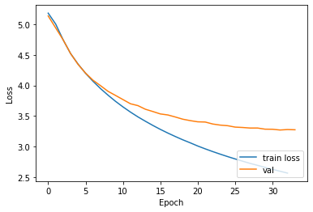

**Predictions**

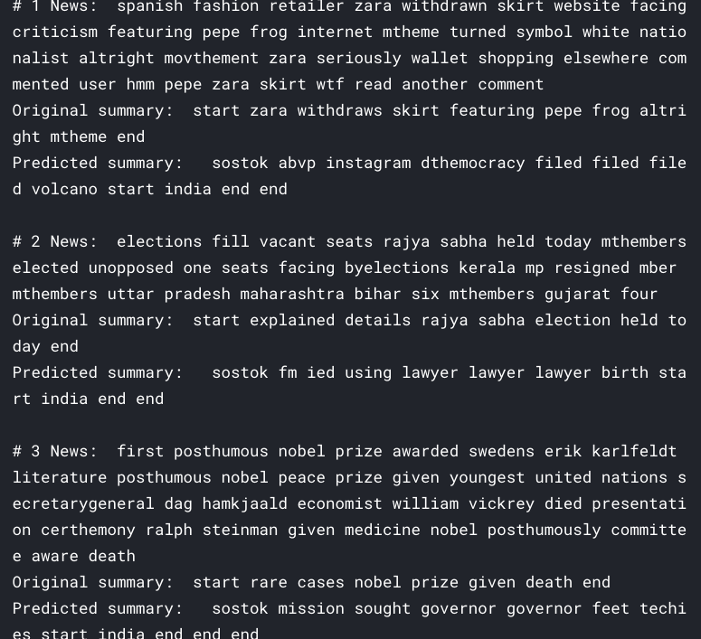

## License

[APACHE LICENSE, VERSION 2.0](./LICENSE)
